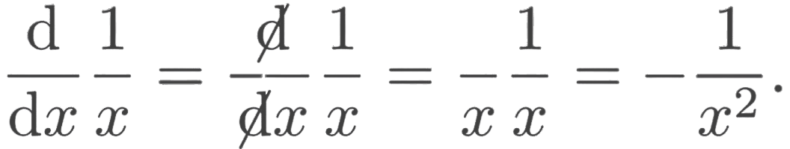

<!--
**cemenenkoff/cemenenkoff** is a ✨ _special_ ✨ repository because its `README.md` (this file) appears on your GitHub profile.

Here are some ideas to get you started:

- 🔭 I’m currently working on ...
- 🌱 I’m currently learning ...
- 👯 I’m looking to collaborate on ...
- 🤔 I’m looking for help with ...
- 💬 Ask me about ...
- 📫 How to reach me: ...
- 😄 Pronouns: ...
- ⚡ Fun fact: ...
-->

Welcome. Here you'll find

  &nbsp;&nbsp;&nbsp;&nbsp;</> Python

  &nbsp;&nbsp;&nbsp;&nbsp;👨‍💻  Machine Learning

  &nbsp;&nbsp;&nbsp;&nbsp;🧪 Data Science

  &nbsp;&nbsp;&nbsp;&nbsp;💫  Physics Simulations

  &nbsp;&nbsp;&nbsp;&nbsp;🤓  Math Jokes

If you have any questions, feel free to send me an email. 😊
